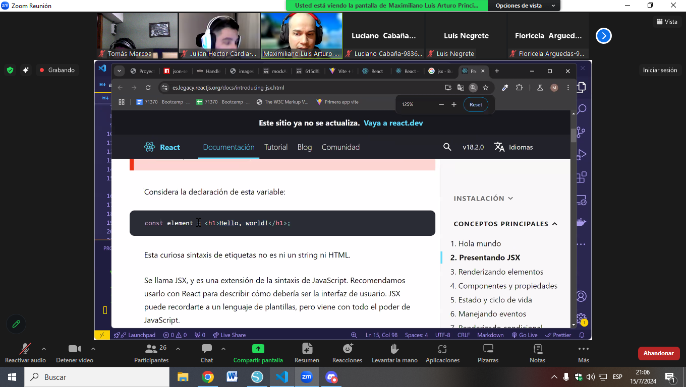

# React
# Para iniciar el desarrollo de un proyecto react
npm create vite@latest ./ 
react
jsavascript
npm i 
npm run dev
## Documentación oficial
Actualizada
https://react.dev/
Desactualizado
Nos potencia mediante el desarrollo frontend, se va a encargar de seleccionar los querySelectors
Facebook creó react y jsx, que es javascript combinado con xml
Se encarga de escribir js como html, html adentro de js

Virtual dom
otra ed las librerías que tiene react, superior a lo que se pueda hacer con cuauqier librería random
Linter y configuración de react en vite
* usernamehw.errorlens
* dbaeumer.vscode-eslint
Herramienta fundamental
dsznajder.es7-react-js-snippets

# Boostrap

npm i bootstrap@5.3.3
# Para que funcione tengo que colocar el script y la hoja de estilos
css 
@import 'bootstrap';
js
import * as bootstrap from 'bootstrap'

# Incorporar json server
Instalamos json server
https://www.npmjs.com/package/json-server/v/0.17.4 De esta página

npm i json-server@0.17.4 -D
-D sirve para que solo lo vea el desarrollador y no se instale en la página
Y agregamos en el package.json, en la parte de scripts:
"server" : "json-server --watch data/db.json --port 8080"
Después de esto, se ejecuta con npm run server
y se detiene con ctrl + c
<http://localhost:8080/productos>
React Router
npm i react-router react-router-dom
CAMBIAR A MOCKAPI LA PARTE 2 DEL PROYECTO

Usar git rm para borrar un archivo
git rm --